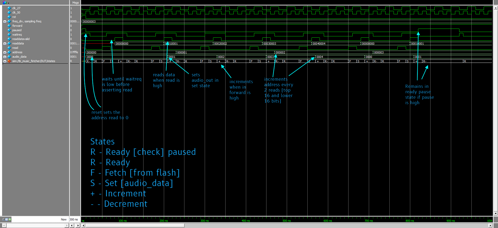
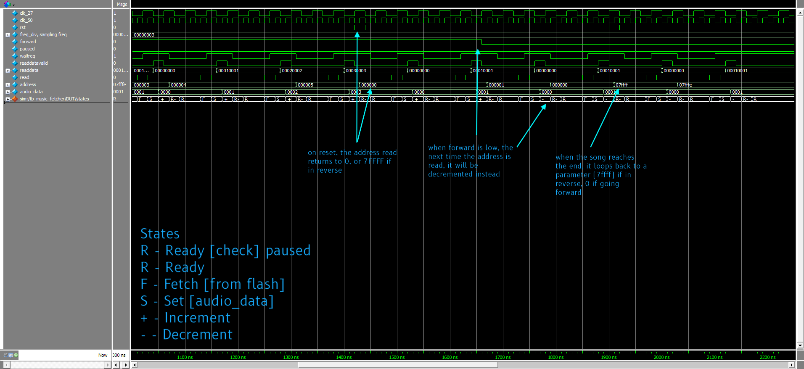
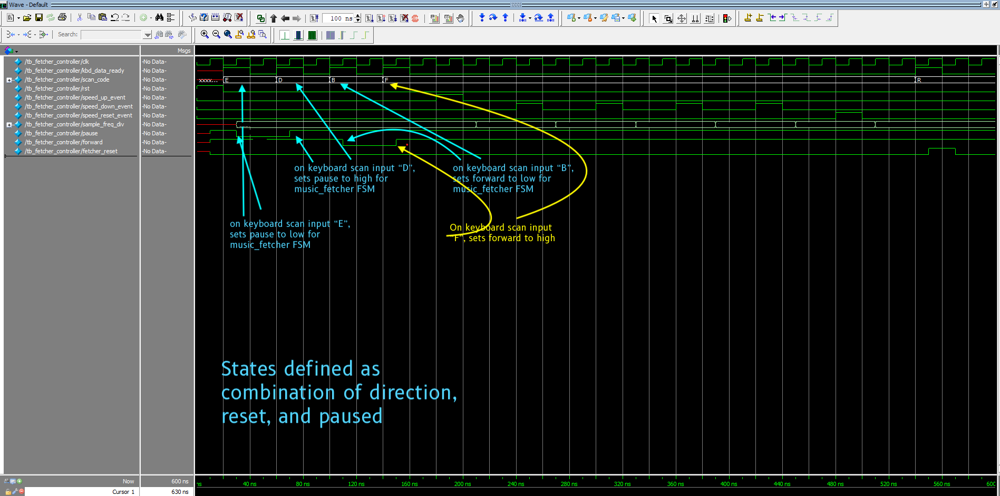
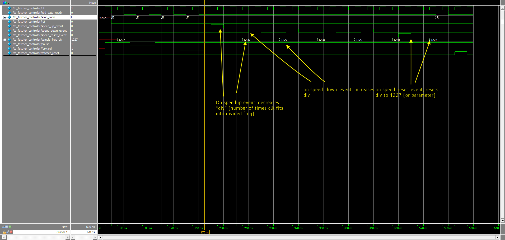
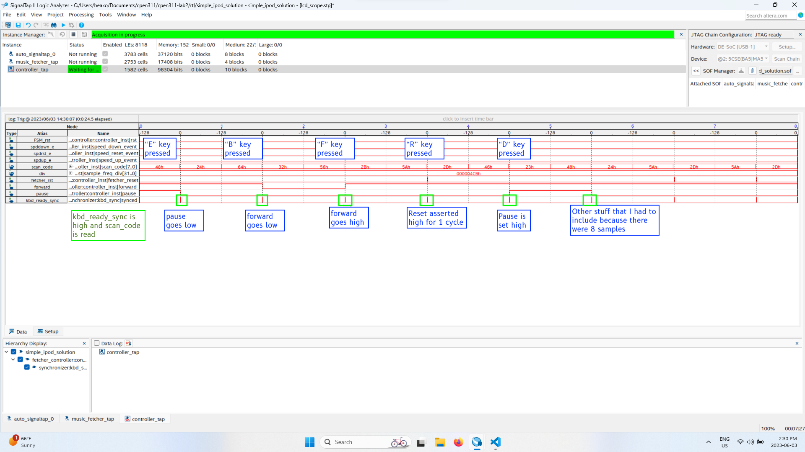
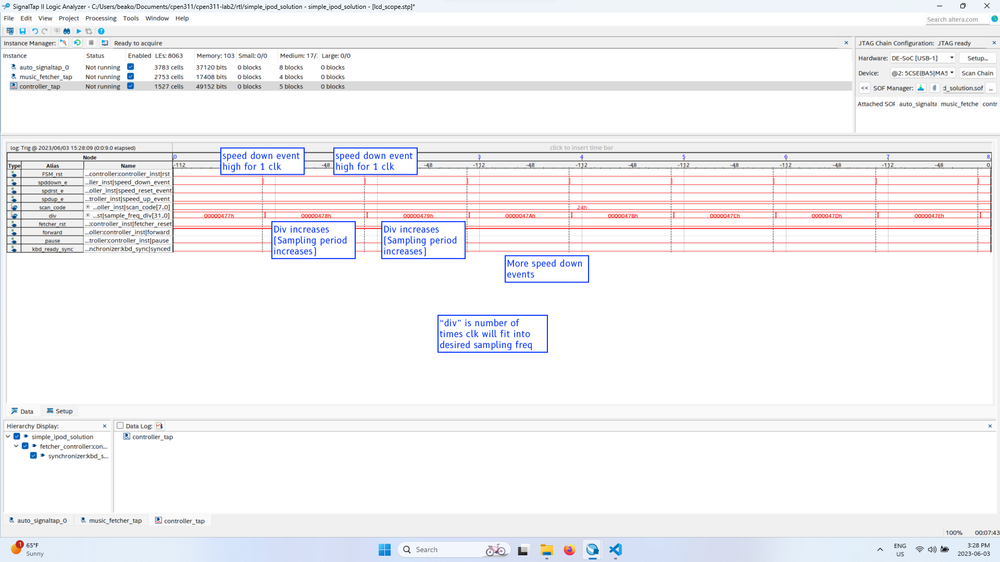
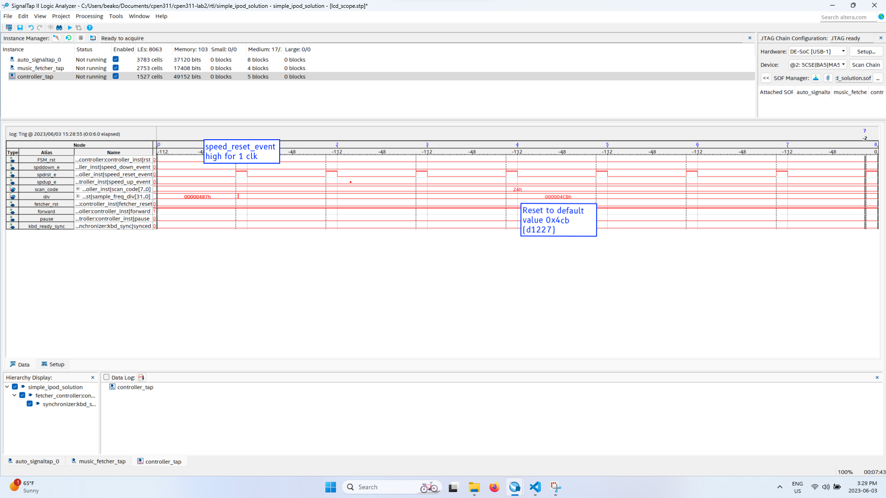
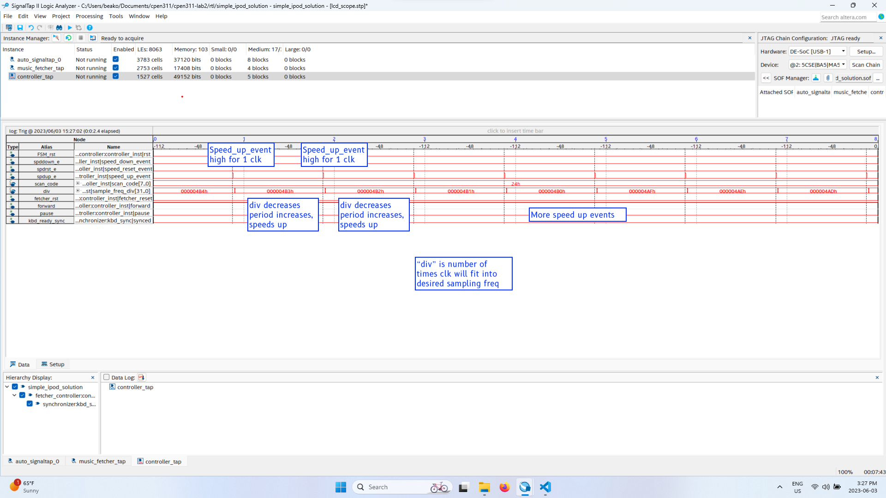
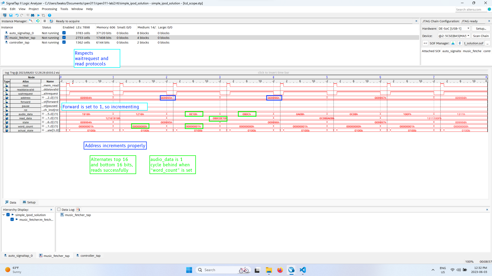
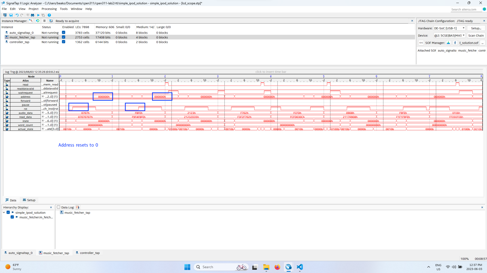

# Something about the CPEN 311 Lab 2
## Something about the SOF File
It is located here:
[./rtl/simple_ipod_solution.sof](./rtl/simple_ipod_solution.sof)

## Something about the status
All parts complete, including music playback, pause, resume, speedup, speed down, speed reset, forward, backward.

R key is implemented

44KHz is implemented

Additional titanic.jic for your listening pleasure.

## Annotated Screenshots
Full sized screenshots are located in the [./doc](./doc) folder

### Simulations
Music fetcher FSM  1 - Wait, read, increment

Music fetcher FSM 2 - Reset, reverse, and song end

Fetcher Controller FSM 1 - Keyboard inputs

Fetcher controller FSM 2 - Pushbutton events

### Signaltap screenshots

Fetcher controller FSM 1, keyboard E, B, F, R, D

Fetcher controller FSM 2 - Speed reset event

Fetcher controller FSM 3 - Speed up event

Fetcher controller FSM 4 - Speed up event

Music fetcher FSM 1, Decrementing addresses

Music fetcher FSM 2 - incrementing addresses

Music fetcher FSM 3 - Resetting

## Something about the simulations
They are located in [./sim](./sim)
They were created using modelsim 10.5b. There is the fetcher controller and music fetcher, which each have their own simulations. 

The test benches are prefixed to the device under test by "tb". You should load that file into modelsim when you start your simulation.

A waves.do file is included so you can see the waves as I intended. There are also some custom radices included so you can see the states and button presses more clearly like my screenshots.

A vsim.wlf is included so you can load the simulations in if you don't want to simulate them again. 

## FSM Diagrams
[./doc/FSMs](./doc/FSMs), or see PDF version below.

## Additional Information
How to customize your songs?

1. Download an mp3 file
2. export as RAW binary
3. Using the intelHex Utility, convert binary to hex
4. using the quartus programmer file converter (or something similar, on file)
5. Set EPCS128
6. Add the Hex file in, the device, and generate.
7. Use JIC file as ususal

Some extra songs are in extra_songs

RTL_44 contains the version that works with 44KHz 8 bit samples. 

